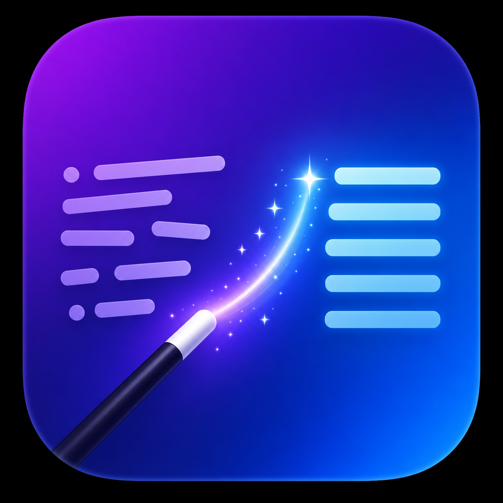

<div align="center">



# MagicText

**Select text anywhere on macOS → press a hotkey → it's refined in place.**

[](../../actions/workflows/ci.yml)
[](../../releases/latest)
[](LICENSE)
[](#install)
[](https://buymeacoffee.com/kunalworldwide)

A native menu bar app that fixes spelling, punctuation and grammar in any text field on your Mac — powered by the AI gateway of your choice, or a local model that never leaves your machine.

[Install](#install) · [Quick start](#quick-start) · [Local models](#local-models) · [Build from source](#build-from-source)

</div>

---

## What it does

Select text in any app. Press **⌃⌥⌘R**. A pill appears near your cursor, and the selection comes back polished — spelling fixed, punctuation corrected, grammar cleaned — without the app ever taking focus.

- **Works everywhere** — Notes, Mail, Slack, Chrome, Xcode… any text field
- **Your AI, your choice** — any OpenAI-compatible gateway: OpenAI, OpenRouter, Groq, Together, Ollama, LM Studio, or a custom endpoint
- **Or fully local** — download an open-source model (Qwen, Llama) and refine text with zero network calls on Apple Silicon
- **Private by design** — API keys live in the macOS Keychain, usage history stays on your disk, no telemetry
- **Native** — pure Swift + SwiftUI, ~170 KB download, no Electron

## Install

Download `MagicText-<version>-macOS.dmg` from [Releases](../../releases/latest), drag to **Applications**, and open it.

> [!NOTE]
> First launch asks for **one** permission: **Accessibility** (System Settings → Privacy & Security → Accessibility). It's how MagicText reads and replaces the selected text — nothing else is requested. Since the app is ad-hoc signed (not notarized), Gatekeeper may ask you to confirm via right-click → Open the first time.

## Quick start

1. Click the wand icon in the menu bar → **Settings**
2. Pick a provider (OpenAI, OpenRouter, Groq, Kimchi, Ollama…) or enter any OpenAI-compatible URL
3. Paste your API key → **Fetch Models** → pick one
4. Select some scruffy text anywhere → **⌃⌥⌘R**

The shortcut is re-recordable in Settings, and the refinement tone (Clean / Formal / Casual / Emoji) is one dropdown away.

## Local models

On Apple Silicon, the **Local Models** tab lists curated 4-bit [MLX](https://github.com/ml-explore/mlx) builds (Qwen 2.5, Llama 3.2) downloaded straight from Hugging Face. The tab shows your machine's memory, a quality rating, download size and RAM needs for each — and marks the **recommended** model that fits your Mac best.

Local refinement means: no API key, no network, no per-request cost. Models are stored in the standard Hugging Face cache (`~/.cache/huggingface`) so other MLX apps can share them.

> [!TIP]
> On an 8 GB Mac start with **Qwen 2.5 1.5B** — it loads in seconds and handles everyday fixes well. On 16 GB+, the 3B models are a clear quality jump.

## How it works

| | |
|---|---|
| **Text capture** | Accessibility API (`kAXSelectedTextAttribute`) with a pasteboard-simulation fallback (⌘C via CGEvent) for web views and stubborn apps |
| **Global hotkey** | Carbon `RegisterEventHotKey` — process-global, survives full-screen apps |
| **Cloud backend** | Any OpenAI-compatible `/v1/chat/completions` + `/v1/models` endpoint |
| **Local backend** | Apple MLX on Metal via [mlx-swift-lm](https://github.com/ml-explore/mlx-swift-lm) |
| **Settings storage** | UserDefaults + Keychain; usage history as JSONL in `~/Library/Application Support/MagicText` |

## Build from source

```bash
git clone https://github.com/kunalworldwide/MagicText.git
cd MagicText
swift test                        # core logic tests
bash scripts/build-app.sh         # build/MagicText.app + DMG
```

Requires Xcode's Swift toolchain (macOS 14+ SDK). CI builds and publishes the DMG on every release tag.

## Roadmap

- [x] v0.1 — refine in place, any OpenAI-compatible gateway
- [x] v0.2 — local MLX models, model manager, usage history, presets
- [ ] v0.3 — per-app tone rules
- [ ] v0.4 — signed + notarized builds, Homebrew cask

## Support

If MagicText saves you time, you can [buy me a coffee](https://buymeacoffee.com/kunalworldwide) ☕ — every cup funds the next feature.

## License

MIT — see [LICENSE](LICENSE).
